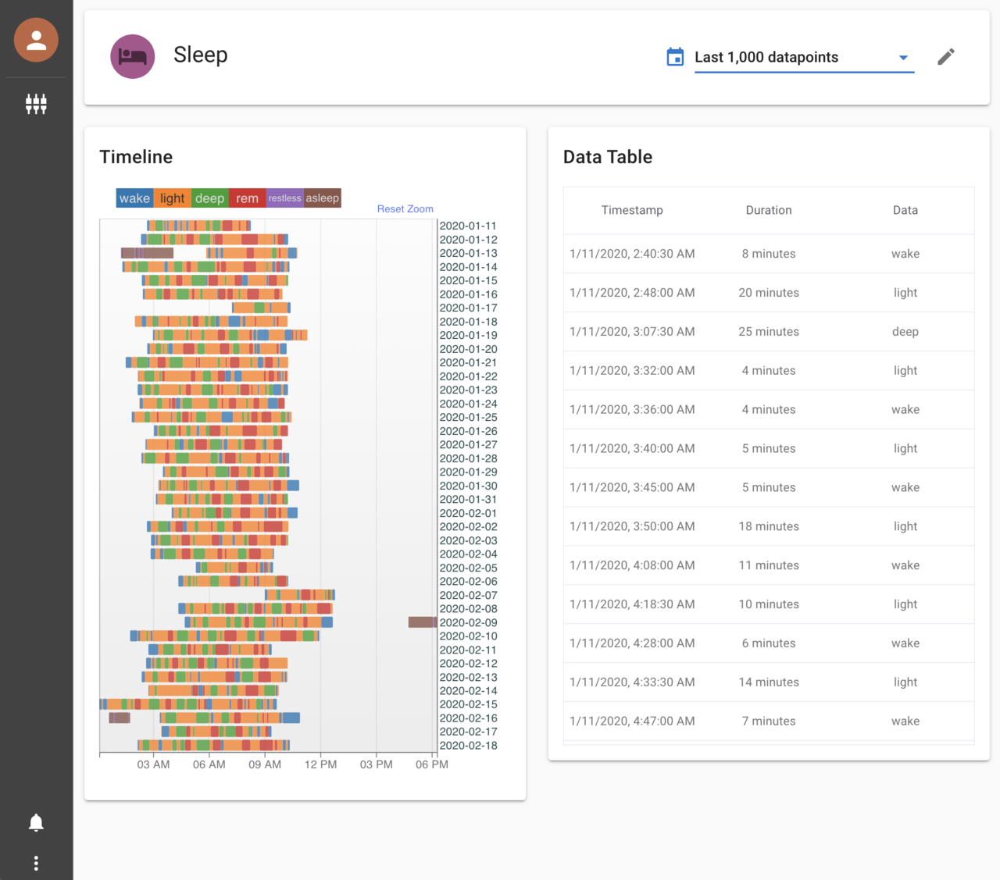
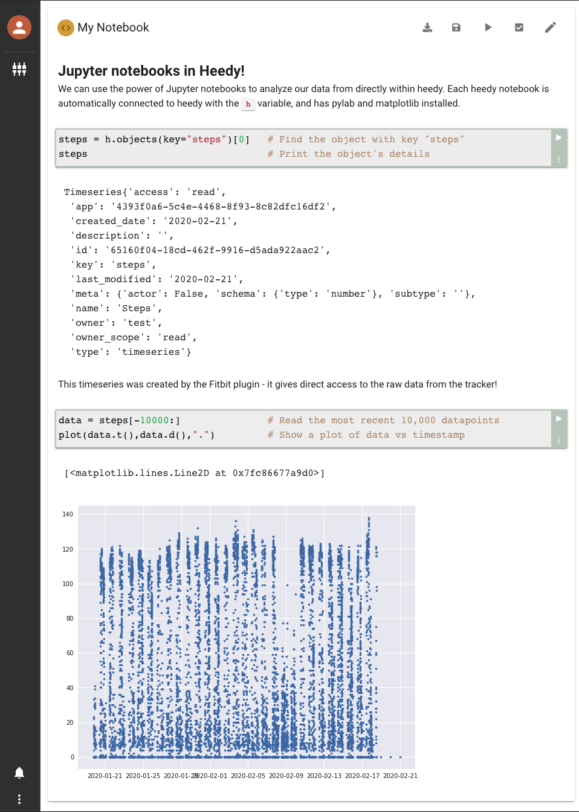

# Heedy

[](https://heedy.org)[](https://github.com/heedy/heedy/releases)[](https://pypi.org/project/heedy/)

A repository for your personal data, and an extensible analysis engine.

There already exist many apps and fitness trackers that gather and attempt to make sense of your data. Most of these services are isolated - your phone's fitness tracking software knows nothing about your browser's time-tracking extension. Furthermore, each app and service has its own method for downloading data (if they offer raw data at all!), which makes an all-encompassing analysis of life extremely tedious. Heedy offers a self-hosted open-source way to put all of this data together into a single system.

Several existing aggregators already perform many of heedy's functions ([see the list here](https://github.com/woop/awesome-quantified-self#aggregators--dashboards)). However, they are all missing one of two critical components:

1. **Open-source and self-hosted**: Most existing tools are cloud-based, which means that all of your data is on "someone else's computer". While these companies may claim that they will not [sell your data](https://arstechnica.com/tech-policy/2019/03/ftc-investigates-whether-isps-sell-your-browsing-history-and-location-data/), or won't [turn it over to governments](<https://en.wikipedia.org/wiki/PRISM_(surveillance_program)>), they can change their minds (and terms of service) at any time. The only way to guarantee that your data will never be used against you is for it to be on your computer, operated by software you can audit yourself.
2. **Extensible**: Even a system with fantastic visualizations and powerful analysis has limited utility. This is because it can only show what the original authors assumed would be useful. Heedy offers a powerful plugin system - plugin writers can add new integrations, plots, or even modify core functionality with a few lines of python or javascript.

## Running

Heedy currently supports Mac and Linux (including the Raspberry Pi). The server is started from the command-line.

1. [Download Heedy](https://github.com/heedy/heedy/releases/latest), it is a single executable file that has everything built-in!
2. Run it:

```bash
chmod +x ./heedy # Allow execution of file
./heedy          # Run heedy
```

3. Open your browser to http://localhost:1324 to set up your database!

_Before setting up Heedy, it is recommended that you have Python >=3.7 with venv support installed, because most heedy plugins use Python! On Ubuntu/PiOS, you just need to install `python3-venv`._

### Docker

Heedy is also available for use with docker. You will want to create a folder (`myheedy`) to hold your heedy database, and bind it to the `/data` folder in the container:

```bash
mkdir myheedy
docker run --rm -d -p 1324:1324 -v $PWD/myheedy:/data --user $UID --name heedy dkumor/heedy
```

This runs heedy in the background on port `1324`. To run interactively, use `-it` instead of `-d`.

## Plugins

Heedy itself is very limited in scope. Most of its power comes from plugins that extend its functionality, and integrate with other services. Some plugins worth checking out:

- [fitbit](https://github.com/heedy/heedy-fitbit-plugin) - sync heedy with Fitbit, allowing you to access and analyze your wearables' data.
- [notebook](https://github.com/heedy/heedy-notebook-plugin) - analyze your data directly within Heedy with Jupyter notebooks.

Installing a plugin is as simple as [uploading its zip file to heedy](https://heedy.org/server/configuration.html#installing-plugins).

## Screenshots

The first screenshot is of sleep data uploaded by the [fitbit plugin](https://github.com/heedy/heedy-fitbit-plugin). The second is a jupyter notebook enabled by the [notebook plugin](https://github.com/heedy/heedy-notebook-plugin). The final screenshot shows Heedy's built-in analysis capabilities.

[](https://github.com/heedy/heedy-fitbit-plugin)
[](https://github.com/heedy/heedy-notebook-plugin)


## Building

Building heedy requires at least go 1.15 and a recent version of node with at least npm 7.

### Release

```
git clone https://github.com/heedy/heedy
cd heedy
make
```

### Debug

```
git clone https://github.com/heedy/heedy
cd heedy
make debug
```

The debug version uses the assets from the `./assets` folder instead of embedding in the executable.

#### Watch frontend

To edit the frontend, you will want to run the following:

```
make watch
```

This will watch all frontend files and rebuild them as they change, allowing you to edit them and see changes immediately by refreshing your browser.

### Verbose Mode

You can see everything heedy does, including all SQL statements and raw http requests by running it in verbose mode:

```
./heedy --verbose
```
