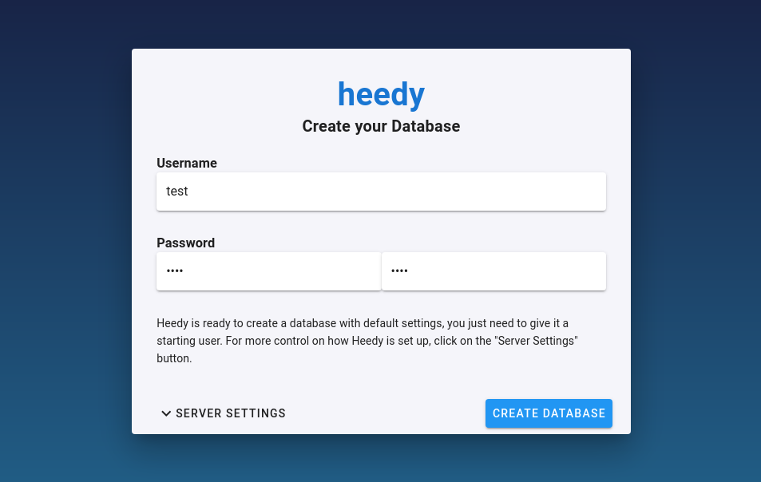
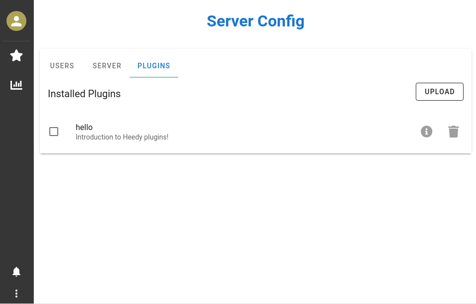
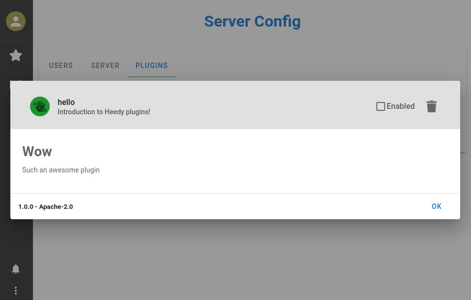
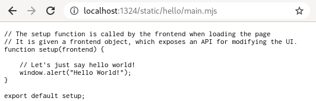
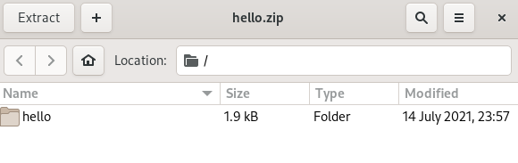
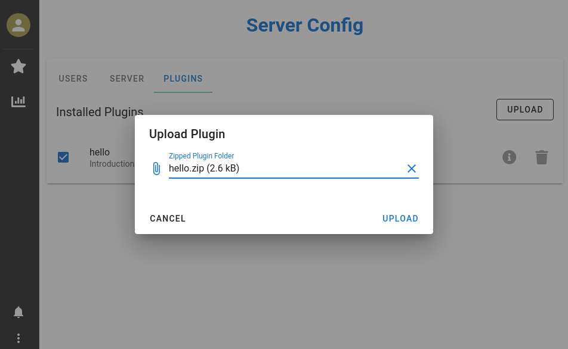

# My First Plugin

This tutorial will teach you the fundamentals of building a basic "Hello World"-style Heedy plugin. This tutorial assumes that you have `heedy` installed, and are on linux or mac (a raspberry pi will do too!). It assumes basic familiarity with the linux command line.

We will start by setting up a heedy database for development and testing of the plugin, and then create a basic Python server that extends Heedy's API.

## Creating a Testing Database

One big no-no of software engineering is testing code on production systems - writing a plugin can be messy work, and depending on how deeply the plugin integrates with Heedy's backend database, you could accidentally delete or corrupt your data if you experiment on your main system.

Instead, we will create a test database in which the plugin will be developed:

```bash
heedy create testdb
```

The above command will start a heedy server on port 1324, and you can then set up a user from the browser - username `test` and password `test` usually does the trick! This will then create a database in the `testdb` folder.



Once the database is created, we can look inside the `testdb` folder, showing following directory structure:
```bash
testdb/
  heedy.conf     # the main heedy configuration file
  data/
    heedy.db     # an sqlite3 database containing heedy data
    heedy.db-shm # ...along with its extra runtime files
    heedy.db-wal # 
    heedy.sock   # a unix socket exposing the plugin REST API.
```

We can now shut down heedy with `CTRL+C` in the terminal.

## Creating a Plugin

Now that we have a heedy database, we will make a basic do-nothing plugin called "hello". We start by creating the plugins directory, then we create a folder for our plugin:
```bash
mkdir testdb/plugins
mkdir testdb/plugins/hello
```

In order for heedy to recognize the plugin, it will need a basic configuration. We write the following to `testdb/plugins/hello/heedy.conf`:

```javascript
plugin "hello" {
    version="1.0.0"
    description = "Introduction to Heedy plugins!"
    // Use a fontawesome hand icon for the plugin
    icon="fas fa-hand-sparkles"
    // The plugin license SPDX code (https://spdx.org/licenses/)
    license = "Apache-2.0"
}
```

The plugin name must be identical to the folder name. Once you save this file, you can start heedy with `heedy run testdb`, and the plugin will show up as an option in heedy's server configuration.



This is the minimal viable plugin - it does nothing, but it can be enabled in heedy, either through the web GUI, or by setting `active_plugins=["hello"]` in `testdb/heedy.conf` (the global configuration file for your database).

Once enabled, any changes to the plugin configuration or backend servers (we'll get to that in a moment!) will require a heedy restart to take effect, while changes to frontend javascript will require a browser hard refresh.

Before moving on to adding functionality to the plugin, let's document what it does by adding a `README.md` to the plugin folder (`testdb/plugins/hello/README.md`), where you can describe what the plugin does using Markdown:
```markdown
# Wow

Such an awesome plugin
```

Heedy will then diplay the README in the plugin description dialog (the *i* button):



## It has to say "Hello!"

A plugin that sits there and does nothing isn't particularly useful, so let's make it say hello. 
Heedy plugins are divided into two separate portions: backend servers and frontend javascript. We will start by adding a backend API service that says hello to whomever calls it.

While these servers can be made in any programming language, Heedy has special built-in support for Python, so we will create a basic server using the [aiohttp](https://docs.aiohttp.org/en/stable/) library.

We create the file `testdb/plugins/hello/hello.py`, and add the following to it:
```python
# You can use any Python server library, but the heedy python library has some quality-of-life
# extras built for aiohttp use.
from aiohttp import web
routes = web.RouteTableDef()

# When starting the plugin server, heedy will send a bunch of important data to it on stdin.
# The Plugin object is meant to be global, and reads this data from input on initialization.
# It also changes the working directory to the `data` folder in the heedy database, so that the plugin can
# access the database or write its own files.
from heedy import Plugin
p = Plugin()

# The plugin will answer GET requests at /api/hello, returning a simple text response.
@routes.get("/api/hello")
async def hello(request):
    return web.Response(text="Hello World!")


# Runs the plugin's backend server
app = web.Application()
app.add_routes(routes)
web.run_app(app, path=f"{p.name}.sock")
```

The above code creates a server that listens on a UNIX socket `hello.sock` in the `data` directory of the database. When calling `p = Plugin()`, the initialization code reads configuration data that the heedy server will send to stdin, and sets up the plugin object with permissions necessary to talk with heedy!

Before we can run it though, we will need to specify the server's dependencies in `testdb/plugins/hello/requirements.txt`:
```
heedy
aiohttp
```
Heedy will automatically make sure that all dependencies in the plugin's `requirements.txt` file are installed before the server is run (heedy creates a separate venv for each plugin by default).

Finally, we tell heedy to start the plugin server, and to forward GET requests from `/api/hello` to this backend server. We do this by modifying the plugin's `heedy.conf`:

```javascript
plugin "hello" {
    version="1.0.0"
    description = "Introduction to Heedy plugins!"
    // Use a fontawesome hand icon for the plugin
    icon="fas fa-hand-sparkles"
    // The plugin license SPDX code (https://spdx.org/licenses/)
    license = "Apache-2.0"

    // Tell heedy to run a python server at backend/hello.py, which
    // can be accessed using unix socket hello.sock
    run "mybackend" {
        type = "python"
        path = "hello.py"
        api = "unix:hello.sock"
    }

    // Tell heedy to forward requests coming to /api/hello to the plugin's backend server
    routes = {
        "GET /api/hello": "run:mybackend"
    }
}
```

The plugin folder structure is now:
```bash
hello/
    heedy.conf       # Heedy configuration file
    hello.py         # The plugin's backend server
    README.md        # Plugin's description README
    requirements.txt # Dependencies of the backend server
```

With that, we restart heedy by exiting it in the terminal with `CTRL+C`, and starting the existing database with
```
heedy run testdb
```

```{warning}
Make sure that you have a recent version of Python installed, along with venv support. On ubuntu/raspbian, run `sudo apt-get install python3-venv` before creating the database, so that heedy automatically detects your Python install! If you already created the database, you will need to set the Python plugin's path in the global `heedy.conf`.
```

Now, navigating to `localhost:1324/api/hello` will give the plugin server's response!


```{note}
You might want to see the details of the backend requests while debugging plugins. Running heedy in verbose mode (`heedy run testdb --verbose`) gives you the full info on how the request was processed.
```

This portion of the tutorial had us create a plugin backend server. In the next portion, we will have a textbox pop up whenever the web GUI is opened in the browser.
## It has to say "Hello" in the frontend!

Heedy's frontend uses [JavaScript Modules](https://developer.mozilla.org/en-US/docs/Web/JavaScript/Guide/Modules) along with [Vue.js](https://vuejs.org) for displaying content. Each plugin that wants to modify frontend functionality creates its own module, and registers it with heedy.

The plugin's javascript must be accessible from the browser. Heedy recognizes the `public` subfolder as holding things that are relevant to serving heedy.
In particular, all of the content in the `public/static` subfolder will be automatically made accessible to *all* visitors to the site.

We therefore create a basic javascript module for the plugin at `testdb/plugins/hello/public/static/hello/main.mjs`.
The convention used in heedy is that each plugin creates its own subfolder within `/static`.

```javascript
// The setup function is called by the frontend when loading the page
// It is given a frontend object, which exposes an API for modifying the UI.
function setup(frontend) {

    // Let's just say hello world!
    window.alert("Hello World!");
}

export default setup;
```

Now we can confirm that the file is accessible from the browser by navigating to `localhost:1324/static/hello/main.mjs`:




Finally, we let heedy know that the plugin wants to do stuff with the frontend, by linking to the module in `heedy.conf` using the `frontend` option:

```javascript
plugin "hello" {
    version="1.0.0"
    description = "Introduction to Heedy plugins!"
    // Use a fontawesome hand icon for the plugin
    icon="fas fa-hand-sparkles"
    // The plugin license SPDX code (https://spdx.org/licenses/)
    license = "Apache-2.0"

    // FRONTEND - the location is relative to /static on the server
    frontend = "hello/main.mjs"

    // Tell heedy to run a python server at hello.py, which
    // can be accessed using unix socket hello.sock
    run "mybackend" {
        type = "python"
        path = "hello.py"
        api = "unix:hello.sock"
    }

    // Tell heedy to forward requests coming to /api/hello to the plugin's backend server
    routes = {
        "GET /api/hello": "run:mybackend"
    }
}
```

Restart heedy so that `heedy.conf` is reloaded, go to `localhost:1324`, and the textbox pops up as the UI is loading!


## Distributing the Plugin

We have our plugin. How do we distribute it, so that users of heedy can upload it using the main upload dialog in the plugin menu of the frontend?

This is our plugin's structure:
```bash
hello/
    public/
        static/
            hello/
                main.mjs # Frontend javascript module
    heedy.conf           # Heedy configuration file
    hello.py             # The plugin's backend server
    README.md            # Plugin's description README
    requirements.txt     # Dependencies of the backend server
```

All we need to do is zip the outer hello folder, so that the `hello` folder is the only thing in the zip file:
```bash
cd testdb/plugins
zip -r hello.zip hello
```



This zip file can now be uploaded and enabled directly using heedy's UI:


## Conclusions

This tutorial taught the absolute basics of setting up a heedy plugin from scratch. A backend extension server was created, and a javascript module was developed that is loaded with the heedy web frontend. The plugin was then zipped into a format that can be directly uploaded into heedy. The raw code for this tutorial [is available here](https://github.com/heedy/heedy/tree/master/docs/plugins/examples/hello).

While this is the raw structure of a plugin, in most cases, you will actually want to use a plugin template with an explicit build step. This will be the subject of the next tutorial!