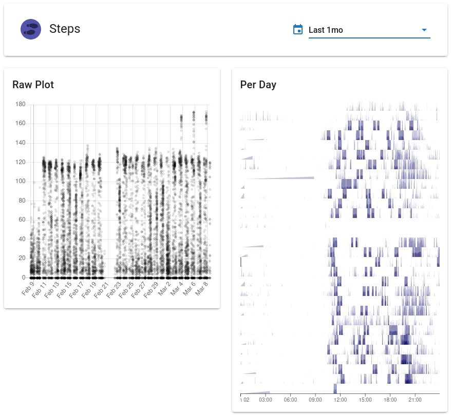
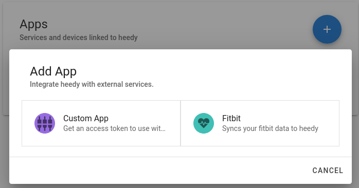

# Core Concepts

The Heedy server is aware of 3 things - objects, apps, and users. Objects are the core of heedy's functionality, and apps/users allow managing access to the objects.

## Objects

You can think of heedy as a system for interacting with, and sharing, objects. Objects can be of different types, with each type defined and implemented by a plugin. Object types are similar to file types - a pdf file is a document, while a exe file is a program. In the same sense, a plugin could define a pdf object type - or even a file/folder/filesystem object type. Objects are intentionally a very general construct, to allow plugin-writers maximal flexibility. Heedy comes with the timeseries object type built-in, and things like the [notebook plugin](https://github.com/heedy/heedy-notebook-plugin) define other types.

### Timeseries

The only object type built into heedy by default is the *timeseries*. Each datapoint in a timeseries holds a timestamp, a value, and an optional duration. This is the object type used to save most data in heedy. The timeseries object type has built-in visualization capabilities, and the associated API allows advanced analysis (either from your own programs, or from directly within heedy using the [notebook plugin](https://github.com/heedy/heedy-notebook-plugin)):

## Apps

Most objects you have in your database won't be manually updated by you. Instead, they will be managed automatically by synchronizing with various services. Each such service corresponds to an App. There are two types of app in heedy:
- **Plugin-based Apps** - these apps are managed by plugins you installed in heedy. Once you've installed a plugin, you can add the apps it defines to your user.
- **External Apps** - these programs connect to heedy's REST API using a secret token, which can be obtained by manually creating a "custom app". These apps only have the permissions defined in the app's scope, so they can have limited access to your database.

An app can restrict its owner's access to objects managed by it. For example, the [fitbit app](https://github.com/heedy/heedy-fitbit-plugin) doesn't allow you to write to its timeseries, since they are synced with fitbit's servers.

## Users

Heedy's users own their apps and objects. A user's apps are not accessible by anyone else, whereas a user can choose to share any objects owned by him/her with other users or make them publicly accessible.

An admin user also has access to heedy's configuration, allowing to install plugins, and to modify `heedy.conf`.
