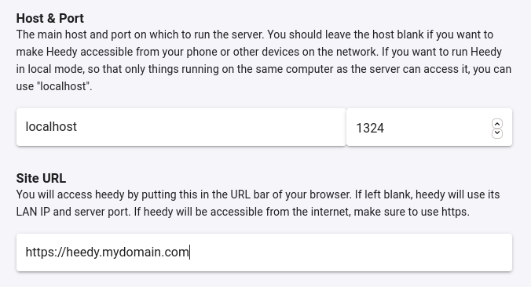

# Setup & Install

The heedy server comes as a single-file executable, which you can download from the [github releases page](https://github.com/heedy/heedy/releases). All you need to do is run `heedy` without any arguments, and it will guide you through setting up and running a database.
For casual use, _nothing else is needed_ - that is, everything should _just work_. The remainder of this document is therefore focused on advanced users, who want more control over their heedy install.

## Python Environment

Since most heedy plugins are written in Python, Heedy attempts to find a valid Python `>=3.7` install automatically while creating a database. It sets this Python up in `heedy.conf`,
or leaves the configuration blank if no supported interpreter is found. You can see and edit the chosen interpreter in heedy.conf (accessible from the database folder, or from the heedy server config UI)
by modifying the `python` plugin `path` setting:

```javascript
plugin "python" {

  // Path to the python >=3.7 interpreter to use for python-based plugins.
  path = "/usr/bin/python3"

}
```

In order for an interpreter to be seen as valid, it must have the ability to create venvs. On Ubuntu, this means that you need to install `python3-venv`.

## Custom Database Location

For advanced users, if you want control over your database location, you can tell heedy to create a new database in the `mydb` folder with:

```
heedy create ./mydb
```

You can run this database by calling:

```
heedy run ./mydb
```

or you can start it in the background by running:

```
heedy start ./mydb
```

The database can then be stopped with:

```
heedy stop ./mydb
```

## Putting Heedy Online

While heedy will run without issues on your local network, some integrations and plugins require that heedy is accessible from the internet, and has its own domain name.
Therefore, to take advantage of heedy's full power, you will want to set it up on a webserver. You will need to purchase a domain name from a provider such as [Namecheap](https://namecheap.com),
and link it to a server you control. As an example, the [heedy.org](https://heedy.org) website is hosted using [DigitalOcean](https://digitalocean.com). A $5/month droplet should be sufficient
to run a basic heedy install.

While setting up a domain and server is rather technical, and outside the scope of this documentation, [tutorials are readily available online](https://www.digitalocean.com/community/tutorials/initial-server-setup-with-ubuntu-18-04).

If you already have a domain `mydomain.com`, it is recommended that you set up heedy on the subdomain `heedy.mydomain.com`.
You can put heedy behind a [Caddy](https://caddyserver.com/) server, which will automatically set up https, but any server software which can handle reverse proxying and https termination should work.

When working with Caddy, you can download the server from [here](https://caddyserver.com/download), give the server permissions to bind to ports 80 and 443 using `sudo setcap cap_net_bind_service=+ep caddy`,
and create a file called `Caddyfile` with the following content:

```
heedy.mydomain.com {
  reverse_proxy localhost:1324
}
```

After starting `heedy`, and then starting Caddy with `./caddy run`,
you can access the heedy setup at `https://heedy.mydomain.com`. While setting up, click the "Server Settings" button to make sure that your host is set to localhost, and the site url is set correctly:



If your database was already created, you can achieve the same effect by modifying your heedy configuration, and restarting:

```javascript
// This is the address on which heedy will listen for connections
addr = "localhost:1324";

// URL at which the server can be accessed. Used for callbacks. If empty,
// this value is populated automatically with the addr value
url = "https://heedy.mydomain.com";
```

## Encrypting your Database

Heedy will be holding very personal data, so you might want to encrypt your database, especially if running on a VPS, where you don't control the server's hard drives.

While heedy does not come with built-in encryption support, if on linux (such as a DigitalOcean droplet), you can use a basic python script called [cryptify](https://github.com/dkumor/cryptify), with which you can set up an encrypted password-protected container for you heedy database:

```
sudo apt-get install cryptsetup
curl -L -o cryptify https://raw.githubusercontent.com/dkumor/cryptify/master/cryptify
chmod +x ./cryptify
```

With this script, you can create a 20GB container for your database, saved as `mydatabase.crypt`, and mounted in the folder `mydatabase` using the following command:

```
./cryptify create mydatabase.crypt 20G
./cryptify open mydatabase.crypt ./mydatabase

heedy create ./mydatabase/heedydb
```

Once you exit heedy, you can close the encrypted container:

```
./cryptify close mydatabase.crypt
```

On future reboots you can run heedy with the following:

```
./cryptify open mydatabase.crypt ./mydatabase
heedy run ./mydatabase/heedydb
```
